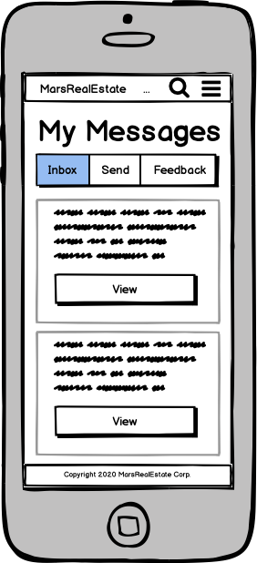
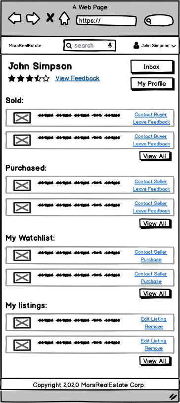

# MarsRealEstate

Link to the deployed app: 
https://warm-brook-32678.herokuapp.com

Link to github repo: 
https://github.com/ChrisR32/MarsHome

## Section 1: Requirement checklist 

Each time you have completed a requirement check it off the list. This way it will be easy for the educators as well as yourselves to track your progress.

- [x] 1. Create your app using Ruby on Rails.
- [x] 2. Use Postgresql database in development and production.
- [x] 3. My app has authentication (eg. Devise).
- [x] 4. My app has authorisation (i.e. users have restrictions on what they can see and edit).
- [x] 5. My app has some type of file (eg. images) uploading capability.
- [x] 6. My app is deployed to Heroku (recommended) or AWS.
- [x] 7. I have identified the problem I am trying to solve by building this particular marketplace app.
- [x] 8. I have explained why is it a problem that needs solving.
- [x] 9. I have provided a link (URL) to my deployed app (i.e. website)
- [x] 10. I have provided a link to my GitHub repository (repo). I have ensured the repo is accessible by my Educators.
- [X] 11. I have a complete description of my marketplace app (website), including:  
        - 11.1 Purpose  
        - 11.2 Functionality / features  
        - 11.3 Sitemap 
        - 11.4 Screenshots  
        - 11.5 Target audience  
        - 11.6 Tech stack (e.g. html, css, deployment platform, etc)  

- [x] 12. I have provided user stories for my app
- [x] 13. I have provided Wire-Frames for my app 
- [x] 14. I have provided an ERD for my app
- [x] 15. I have explained the different high-level components (abstractions) in my app
- [x] 16. I have listed and described any third party services that your app will use
- [x] 17. I have described my projects models in terms of the relationships (active record associations) they have with each other.
- [x] 18. I have discussed the database relations to be implemented in my application
- [x] 19. I have provided my database schema design
- [X] 20. I have described the way tasks are allocated and tracked in my project

NB Slide/Presentation specific requirements

- [x] 21. An outline of the problem I solved by building this particular marketplace app, and why it’s a problem that needs solving.
- [x] 22. A well planned walkthrough of my app
- [x] 23. I have practived my presentation at least once and it is 5-6 minutes long. 

## Rubric Criteria

## Section 2: Documentation 

## 1. Explain the different high-level components (abstractions) in your App.

##### 'bootstrap-sass'
For the Sites Look and feel I used Bootstrap-saas. I found it really good to use and had been playing with it in random apps I had been making during the lead up to this assignment

##### 'toastr-rails'
I used toaster to give a much better professional feel to the pop up error messages and confirmations, I think it did a great job.

##### 'omniauth' // 'omniauth-facebook'
I used omniauth to add the sign-up or sign-in with facebook, had a feq niggles hear and there but It worked properly in the end (for the most part)

##### 'paperclip' / ajax
I used paperclip to upload the listings photos at more then one a time and ajax to to displaythem and delete them off the page without needing to refresh. I never worked out the Java Script side 100% so I find the first time you want to upload you need to refresh the entire upload page before it'll actually accept the upload direction.

##### gem "figaro"
I used figaro after I learn't the hard way what happens when you upload your API passwords and keys to github.  Had so many phone calls from Seattle and New York for days till I eventually made my github private again. I'm still not sure if I got them all off and if when I make my github public again to hand in this assignment i'll take down my AWS and Mail-Gun agian. Anyhow Figaro is just a manager of the these values and I found it really easy to then push them to heroku using the figaro gem.

## 2. List and describe any 3rd party services.
##### aws s3
AWS s3 is where the users listings photos are stored instead of using local storage, works realy well until you publish the api password :)

##### heroku
Heroku is where my app is uploaded publically, Due to the circemstances I faced lastweek I only got to play with the app on there for about 24hrs and never managed to get it running just right like it was running locally. My last push to git hub (with this completed Readme) is of all the little things I did to get running the best I could with the time I had left.

##### g-mail
This was how I handled devises email confirmations originally, worked great, interstingly heard nothing from them when I published their secret key.

##### mail-gun
This is what I replaced g-mail with, i can see this would be an invalualable tool if you were running a business, being able to track whats happening with your emails, when their are oppened etc would generate alot of data that could be used to target customers and market towards them. I can also see why debt collectors would love the same information.

##### Facebook api
To get OmniAuth to work with facebook I needed to create a facebook app though their developers page. Then I use this api to link them.

## 3.1. Identify the problem you’re trying to solve by building this particular marketplace App?
* My plan was maybe abit different, it takes place in a different reality maybe, or maybe the future? My goal was to be the first to market in offering this unique service with the hope that maybe in 80 years or something I get a big fat check delivered to me in my nursing home, maybe get featured in Time magazine as a visionary who cournered the Mars market before there even was one with a whole collection of offers eg: MarsGoogle, MarsSoft, MarsBay, MarsSnakeBay of course etc... all based under the parent company MarsMonopoly Inc. The Time Magazine article would tell tell my story how people laughed at me, banks told me I was dreaming, but I stuck to my guns and built my dream and i'm the only one laughing now, we'll at least I would be if it wasn't for that hip replacemnt. In all my TV interviews I would talk about my proudest moment when my Grandson came to me a few weeks ago and told me that he quit his job, and patented JupiterEstate, the happiness and piece that gave me meab=ning I can goto my grave knowing that in about 80 years he'll be set for life also and who knows maybe his grandson will have ambitions for PlutoEstate, a family legacy of forward thinkers, who dared to make their visions a reality...

## 3.2 Why is the problem identified a problem that needs solving?
* It all comes down to what I explained in the above 3.1, but it needs to be directed into this model though out time. There would have to be the inside man who was there at the start of the Mars Colininazation and influnces the original Marsian laws to the MarsMonoply Values and Vision. For example the Mars Dealer Network that Samatha talks about in her User Story bellow would be put into place years in advance all slowing pushing pushing the people towards needing MarsEstate and the MarsMonopoly family, so the truth of it all is we would create the problem from behind the scences then offer the solution and way out, its kinda how conspiracy people think these days that there are people that decicied years ago to direct Earths future to thier benifit, dependace on petrol etc. This was just step one on my long game, with the plan to take control of Mars and removing the Dictator Musk who my history will teach was behind all the 'behind the scences', problem creating dodgeness all along...

## 4. Describe your project’s models in terms of the relationships (active record associations) they have with each other.

#### USER MODEL
So the user is the auctual person that is using my app this user has 2 connections associated to it:
1. It has many listings (as the user can list as many properties as they wish) 
2. And it has many purchases (as the user can purchase as many properties as they wish)

#### LISTING MODEL
The listing is the acutual property that is up for sale ans hass the following associations to it:
1. It belongs to a user (this is the user that created the listing) thus it's that user's listing
2. It has many Photo's, so this the photos of that property and as thus is linked to it. and of course the listing can have as many photos as needed
3. lastly it has one purchase, as it can only be sold once not many times, if it was marsbnb for example it would have many as the it could be rented out multiple times

#### PHOTO MODEL
This one is pretty basic:
1. It belongs to its accossicated listing
2. Has an attached file which is the image

#### PURCHASE MODEL
The purchase model is kinda special:
1. It belongs to the the user that created the listing
2. And also belongs to the linkied listing
3. Though it also indexes the purchasing user_id, this is so we know who bought what and who sold what

#### CONVERSATION MODEL
This belongs to 2 parties:
1. It belongs to the sender
2. And it belongs to the recipent. It needs to belong to both these parties as otherwise it would be much more like a group chat, or public forum type of deal, while doing it this way keeps it between the 2.
3. Lastly it has many messages, which is the comunication between the two users

#### MESSAGE MODEL
Again like the purchase model this is kinda unique:
1. it belongs to the users that are comunicating though the messages
2. And it bellongs to the conversation that is like the index of the messages

## 5. Discuss the database relations to be implemented.

#### END USER DB CHANGES
My original planned ERD is pictured above thought it end quite differnet and not just because I never finished it 100% in the end I had the Users database which needed things in it I had never even concidered before (alot of them were for devise):
- encypted password (needed with facebook login to generate a random password for the user this also made some selective devise editing/configuration inorder for the user to update their password without knowing thier password, which I was never happy with and intended to change to a email password reset command but never got there)
- reset password token
- reset password sent at
- created at
- updated at
- provider
- uid
- image_fb (never implemented it though)
- confirmation token
- confirmed at
- confirmation sent at
- reset password token
- description (added this to add more meat to the users profile page)

#### END LISTING DB CHANGES
- I didn't end up moving address into a seperate table, i'm not too sure what I was thinking their in the first place and apart from the created_at, updated_at and sold this DB stayed fairly close to how I envisioned. I found the created, updated and sold values really necassary to build the listing view pages, having those values to dress up and use, invalialable.

#### END MESSAGING DB CHANGES
- THe main thing that happened here was when it came to adding it this feature from all the examples and tutorials i found online I realised it needed the conversations table to index it. This didn't really make sence to me until i implemented it and wrapped my head around that the conversations needed to be there to keep it between the 2 users, though I had it at one point between 4, all unintended though.

#### END LISTING_PHOTOS CHANGES
- Again my plan was close just things for paperclip like content type, file size I hadn't thought of before trying to get it to work.

#### Listing sold prettymuch became the purchases table
- I wanted this mainly to have the rating model that planned to add later on, and I also thought It important that a purchase be listed seperatly and not alow the user or buyer to delete the record. I did want to add like a 90 day auto delete type thing but agin didn't end up that way.

##### NEVER USED OR IMPLEMENTED
- Address: I don't don't know wtf i was thinking lol
- Rating_buyer, Rating_seller and thus rating total
- Profile picture: I was going to let the user upload a profile picture but in the end just gave them a selection of preset images to choice from, I think it made it more fun.
- Email and Phone: I had these as I wanted to implement email and phone confirmation to add trust to the users profiles, I'm sure sure why I thought I needed it in seperate table at the time as devise just did it under the users table.

I guess all up I've learnt that until you use all these differnet gems etc regualary theres going to be things needed that you never would of thought of.

Bellow is what my database looked like at the end

## 6. Provide your database schema design.
My original plan for the ERD, uploaded on github at the begining

Bellow is what my database looked like at the end

## 7. Provide User stories for your App.
2 User Stories are bellow:

## 8. Provide Wireframes for your App.
All uploaded on githab as I did them

Bellow is what I drew up for the sie map:

## 9. Describe the way tasks are planned and tracked in your project.
All these were uploaded with at the sametime as my github pushes and can be viewed on github to show the timeline.

Following is listed lastest to eariliest

## 10. ERD provided represents a normalised database model.

Bellow is my original plan for the database:

Bellow is what my database looked like at the end

